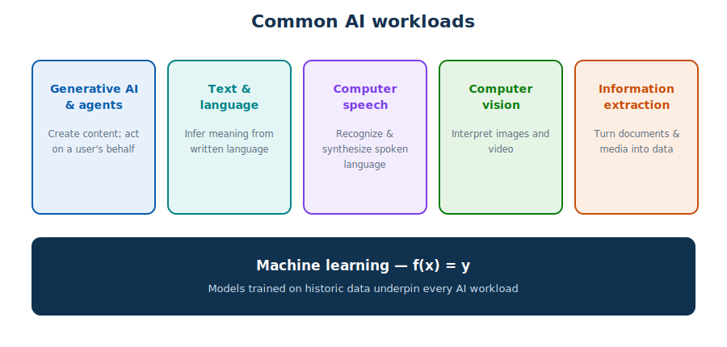
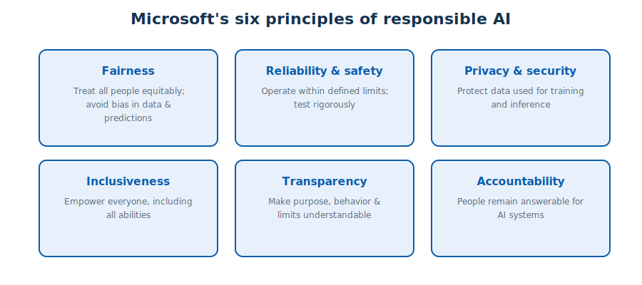
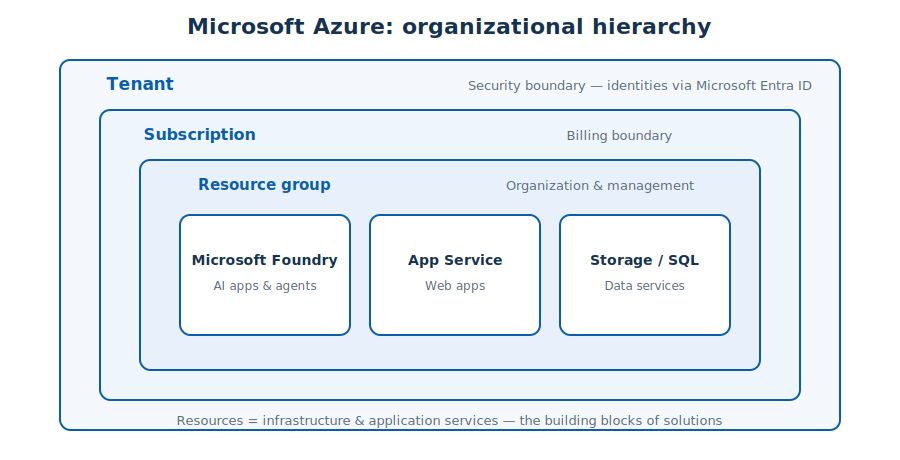
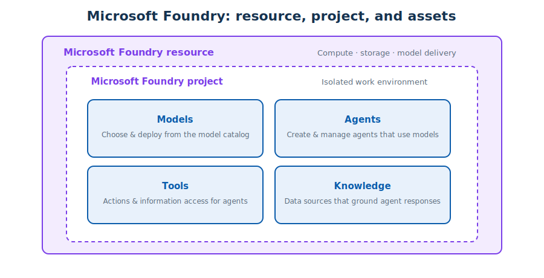
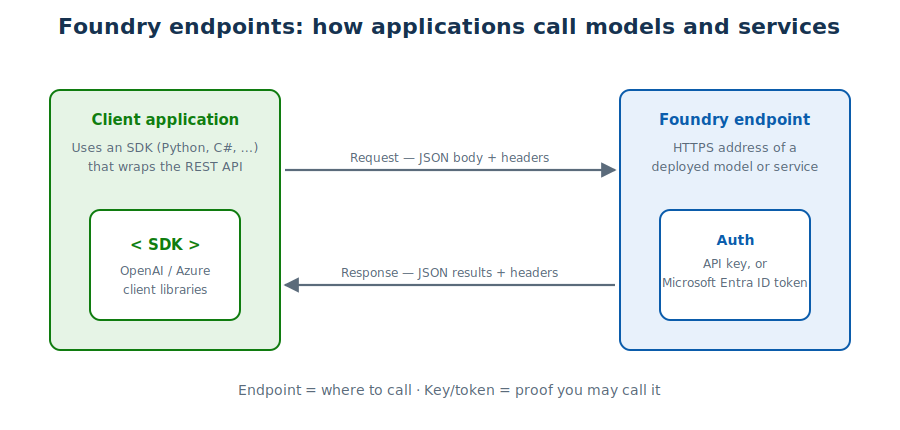

# Module 1 — AI Concepts & Getting Started with AI in Azure

> **Exam mapping:** *Identify AI concepts and capabilities* (~40%) and the foundations of
> *Implement AI solutions with Microsoft Foundry* (~60%).
> **Public references:** <https://aka.ms/mslearn-ai-concepts> · <https://aka.ms/mslearn-get-started-azure-ai>

---

## 1.1 What is Artificial Intelligence?

Artificial Intelligence (AI) is **software that imitates human capabilities**. In practice that
means software able to:

- **predict outcomes and recognize patterns** from historic data,
- **evaluate content and make decisions**, then take an appropriate action,
- **understand and generate language**, holding natural conversations,
- **interpret visual input** such as images and video,
- **extract information** from documents and media to build knowledge.

AI is transforming business, education, healthcare, manufacturing, agriculture and more — but
every capability above ultimately rests on **machine learning (ML)**: models trained on data to
map an input to an output, conceptually `f(x) = y`.

## 1.2 The five common AI workloads

| Workload | What it does | Typical examples |
|---|---|---|
| **Generative AI & agents** | Creates original content from prompts; agents act on a user's behalf | Chat assistants, copilots, automated workflows |
| **Text & language (NLP)** | Infers meaning from written language | Sentiment analysis, entity extraction, summarization |
| **Computer speech** | Recognizes and synthesizes spoken language | Transcription, voice assistants, screen readers |
| **Computer vision** | Interprets images and video | Object detection, image captioning |
| **Information extraction** | Converts documents/media into structured data | Invoice processing, call analysis |

**Key distinctions the exam loves:**
- *Generative AI* uses a **language model to create original content in response to a prompt** —
  it is **not** an "old" form of AI, and it is **not** restricted to data scientists.
- An **AI agent** is *an application* that can perform tasks on behalf of a user — not a person.

## 1.3 Responsible AI — the six principles

| Principle | One-line meaning | Classic exam scenario |
|---|---|---|
| **Fairness** | Treat all people equitably; avoid bias | A loan model must not disadvantage a demographic group |
| **Reliability & safety** | Work correctly within defined limits; test rigorously | Autonomous vehicle / medical prediction must be validated |
| **Privacy & security** | Protect the data used to train and run models | Personal data must be secured during training & inference |
| **Inclusiveness** | Benefit everyone, including people with disabilities | Add captions/audio descriptions to reach all users |
| **Transparency** | Users should understand purpose, behavior, and limits | Publish what data a system uses and how it decides |
| **Accountability** | Humans stay answerable for AI decisions | Governance framework; a person can override the system |

> **Tip:** questions usually describe a scenario and ask *which principle applies*. Match the
> action word: bias→Fairness, testing→Reliability, personal data→Privacy, disability→Inclusiveness,
> "explain/understand"→Transparency, "who is responsible"→Accountability.

## 1.4 Microsoft Azure — where AI solutions live

- A **tenant** is the organizational **security boundary**; identities (users, services) are
  managed and authenticated through **Microsoft Entra ID**.
- A **subscription** is the **billing boundary** inside a tenant.
- **Resource groups** organize and manage related resources.
- **Resources** are the building blocks — including **Microsoft Foundry**, Azure's platform for
  AI apps and agents.

## 1.5 Microsoft Foundry

**Microsoft Foundry** is a unified platform for building AI apps and agents **on top of Azure**
(it uses Azure compute, networking, identity and security — it does not replace Azure).

- A **Foundry resource** provides compute, storage, model delivery and related services.
- A **Foundry project** is an isolated work environment for development. Within a project you
  work with four asset types:
  - **Models** — choose and deploy from an extensive multi-provider **model catalog**;
  - **Agents** — create/manage agents that use models for language and reasoning;
  - **Tools** — connect agents to capabilities so they can act and access information;
  - **Knowledge** — manage the data sources agents use to ground their answers.

## 1.6 Endpoints, keys and SDKs

- An **endpoint** is an **HTTPS address** an application calls to reach a deployed model or
  service.
- Requests are authenticated with an **API key** or a **Microsoft Entra ID token**.
- Endpoints expose **REST** interfaces: the request carries headers plus a **JSON** body; the
  response returns headers plus JSON results.
- In real projects you rarely call REST directly — **SDKs** (Python, C#, JavaScript, …) wrap the
  API for you.

> **Memory hook:** *endpoint = where to call; key = proof you're allowed to call it.* The key is
> never a storage location, and the endpoint never "stores secrets."

## 1.7 Quick self-check

1. Which boundary does a subscription define — security or billing? *(billing)*
2. Name the four asset types in a Foundry project. *(models, agents, tools, knowledge)*
3. A model must be tested to operate safely in bad weather — which principle? *(reliability & safety)*
4. What two things authenticate a call to a Foundry endpoint? *(API key or Entra ID token)*

**Next:** [Module 2 — Generative AI and agents](02-generative-ai-and-agents.md)
