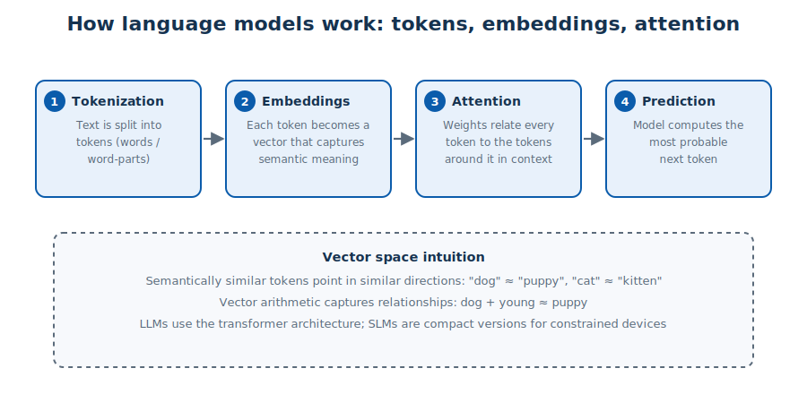
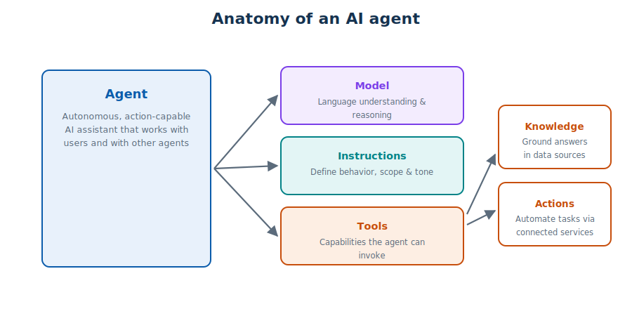

# Module 2 — Generative AI and Agents

> **Public references:** <https://aka.ms/mslearn-intro-gen-ai> · <https://aka.ms/mslearn-get-started-gen-ai-agents>

---

## 2.1 What is generative AI?

Generative AI produces **original content in response to a natural-language prompt**. Output can
be natural language (text or speech), **images and video**, or **code** (Python, C#, SQL, …).

Typical applications:
- **smart chatbots** that generate answers dynamically instead of using hard-coded replies,
- **creative assistants** producing original text, artwork and code,
- the foundation of **agentic AI** — automation through smart, connected agents.

Generative AI is powered by **large language models (LLMs)**. **Small language models (SLMs)**
are compact alternatives for devices and other resource-constrained environments.

## 2.2 How language models work



Modern LLMs are built on the **transformer** architecture:

1. **Tokens** — text is split into small units (words or word-parts).
2. **Embeddings** — each token is encoded as a **vector** that captures semantic meaning.
   Semantically similar tokens point in similar directions in vector space, and vector
   arithmetic captures relationships (*dog + young ≈ puppy*).
3. **Attention** — for each token, the model weighs its relationship to the tokens around it.
   This is how context is encoded.
4. **Prediction** — using those attention-weighted vectors, the model repeatedly predicts the
   most probable *next token*, generating fluent output.

> **Exam anchors:**
> *LLM* = AI model designed to generate human-like text.
> *Embeddings* = vector representations of tokens capturing semantic meaning.
> *Attention layer* = examines relationships between each token and the tokens around it.

## 2.3 What are agents?



An **agent** is an autonomous, action-capable AI assistant. It combines:

- a **model** — language understanding and reasoning,
- **instructions** — define behavior and scope (the "job description"),
- **tools** — used to find **knowledge** (grounding data) and perform **actions** (automation).

Agents collaborate with **human users** and with **other agents** — multi-agent workflows chain
specialized agents, each with its own responsibility.

## 2.4 Foundry Models — the model catalog

The Foundry **model catalog** is a central hub to **discover, filter, compare and deploy**
generative AI models from **multiple providers**:

- **Models sold directly by Microsoft** — billed through your Azure subscription (Azure OpenAI
  models and other collections).
- **Partner & community models** — purchased from trusted third-party providers.

**Deployment considerations** (know all four):

| Setting | Controls |
|---|---|
| **Deployment type** | Where data is processed and how you pay |
| **Version** | Which model version + auto-update policy |
| **Rate limits** | Maximum **tokens-per-minute (TPM)** throughput |
| **Guardrails** | Responsible-AI content policies applied to the deployment |

## 2.5 Using a generative model

Two ways to work with a deployed model:

1. **Model playground** (Foundry portal) — test prompts, compare models, tune settings, then
   grab working code. It does *not* remove the need for deployment or an API — it's for
   experimentation before you write code.
2. **OpenAI-compatible APIs / SDKs** — consume the model from application code.

You shape model behavior with three levers:

- **Instructions (system prompt)** — context and guidelines for *how* to respond.
- **Input (user prompt)** — the request itself; explicit, detailed prompts give better output.
- **Parameters** — e.g. **temperature** ("creativity"/randomness) and maximum response length.

```python
from openai import OpenAI

client = OpenAI(base_url="<your-foundry-endpoint>", api_key="<your-api-key>")

response = client.responses.create(
    model="<your-model-deployment-name>",
    input="Explain the Turing Test in two sentences.")
print(response.output)
```

*Reading the pattern:* create a **client** bound to the endpoint + key → call
`responses.create()` with the **deployment name** and the prompt → read the output.

## 2.6 Creating agents with the Foundry Agent Service

- Save a model configuration as a **named agent**, or build one directly.
- Add **tools**: *knowledge* (file search, web, data sources) and *actions* (connected services,
  code generation).
- Test in the **agent playground**.
- Connect from code with the **Foundry Project API**:

```python
from azure.identity import DefaultAzureCredential
from azure.ai.projects import AIProjectClient

project = AIProjectClient(endpoint="<project-endpoint>",
                          credential=DefaultAzureCredential())
agent = project.agents.get("expenses-agent")
openai_client = project.get_openai_client()

response = openai_client.responses.create(          # ← this line submits the prompt
    input=[{"role": "user", "content": "How do I submit an expense claim?"}],
    extra_body={"agent": {"name": agent.name, "type": "agent_reference"}})
print(response.output_text)
```

> **Exam anchor:** the line that *submits a prompt to the agent* is the
> `responses.create(...)` call — `agents.get()` only fetches the agent definition and
> `get_openai_client()` only creates the client object.

## 2.7 Quick self-check

1. What architecture underpins modern LLMs? *(transformer)*
2. Which deployment setting caps tokens-per-minute? *(rate limits)*
3. Which parameter increases response randomness? *(temperature)*
4. Agent = model + \_\_\_ + \_\_\_. *(instructions + tools — knowledge & actions)*

**Next:** [Module 3 — NLP & text analysis](03-nlp-and-text-analysis.md)
