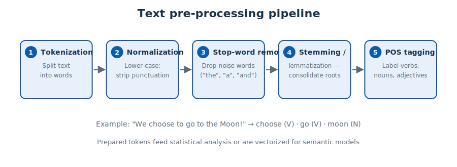
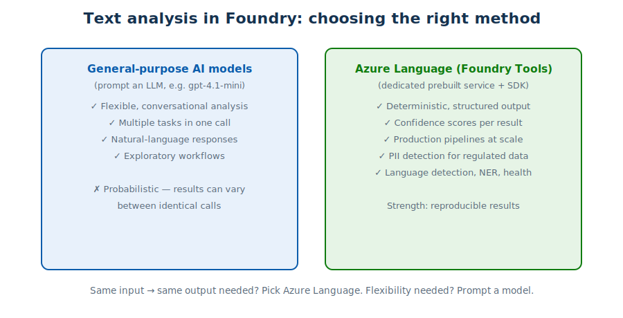

# Module 3 — Natural Language Processing & Text Analysis

> **Public references:** <https://aka.ms/mslearn-nlp-concepts> · <https://aka.ms/mslearn-get-started-ai-text>

---

## 3.1 What is NLP?

Natural language processing (NLP) is about **inferring meaning from text**. Core text-analysis
tasks:

| Task | Question it answers |
|---|---|
| **Key-term / key-phrase extraction** | What are the main topics? |
| **Named entity recognition (NER)** | Which people, places, organizations, dates appear? |
| **Text classification** (incl. **sentiment analysis**) | What category / tone is this? |
| **Summarization** | What's the short version? |
| **Language detection** | Which language is this written in? |
| **PII detection & redaction** | Which values are personally identifiable? |

Common use cases: indexing documents for search, PII redaction, intent prediction for chatbots,
spam filtering, social-media analysis, article categorization.

## 3.2 Text pre-processing



Before analysis, raw text is prepared:

1. **Tokenization** — split text into words/units for analysis.
2. **Normalization** — remove capitalization and punctuation.
3. **Stop-word removal** — drop common "noise" words (*the, a, it, and*).
4. **Stemming / lemmatization** — consolidate word roots (*power, powered, powerful*).
5. **Parts-of-speech (POS) tagging** — label each word as verb, noun, adjective, …

## 3.3 Statistical vs semantic analysis

**Statistical techniques** work on token counts:

- **Term Frequency (TF)** — most common tokens ≈ key topics of a document.
- **TF-IDF** — a word's frequency in *this* document **relative to** its frequency across *all*
  documents → importance of a word to a specific document within a collection.
- **Bag-of-Words (BoW)** — frequencies of words from a set correlate with a classification
  (e.g., *happy, great, fantastic* → positive).
- **TextRank** — sentence-relevance scoring (based on the PageRank idea), commonly used for
  **extractive summarization** (pick the *n* most relevant sentences).

**Semantic models** vectorize tokens as **embeddings** trained to capture meaning — this is the
basis of modern LLMs. Embeddings capture semantic relationships in multiple dimensions; they are
*not* translations or stop-word lists.

## 3.4 Text analysis in Microsoft Foundry — two routes



| | **General-purpose model** (prompt an LLM) | **Azure Language in Foundry Tools** |
|---|---|---|
| Style | Flexible, conversational | Dedicated, prebuilt service |
| Output | Natural language; combine many tasks in one call | **Deterministic, structured**, with **confidence scores** |
| Best for | Exploration, ad-hoc analysis | Production pipelines, regulated data (PII), reproducible results at scale |
| Trade-off | Results may vary between calls (probabilistic generation) | Fixed task set |

Azure Language capabilities include **PII extraction, language detection, named entity
recognition, and Text Analytics for Health**.

> **Rule of thumb:** *"same input must return the same structured result"* → **Azure Language
> SDK**. *"flexible natural-language analysis"* → **general-purpose model via OpenAI API**.

## 3.5 Client applications

**Route 1 — OpenAI library** (general-purpose model): create an `OpenAI` client with endpoint +
key, call `client.responses.create(model=deployment, input=prompt)`.

**Route 2 — Azure Language SDK** (`azure-ai-textanalytics`):

```python
from azure.ai.textanalytics import TextAnalyticsClient
from azure.core.credentials import AzureKeyCredential

client = TextAnalyticsClient(endpoint="<foundry-endpoint>",
                             credential=AzureKeyCredential("<key>"))

docs = ["Alex and I attended a Microsoft AI conference in Las Vegas on September 21st."]
result = client.recognize_entities(documents=docs)[0]
for e in result.entities:
    print(e.text, e.category, e.confidence_score)
```

- The **client object** is what lets your code communicate with the service (endpoint + key or
  Entra ID credentials).
- You submit a **collection of documents** for analysis.
- Handy methods: `detect_language()` → language name, ISO 639-1 code, confidence;
  `recognize_pii_entities()` → **redacted text** + entity list + confidence per entity;
  `extract_key_phrases()`, `analyze_sentiment()`, `recognize_entities()`.

## 3.6 Azure Language inside an agent (MCP)

Agents can call Azure Language through the **Model Context Protocol (MCP)**: the Azure Language
**MCP server exposes Language capabilities to agents as tools**. You connect the tool to your
agent (specifying the Foundry resource + credentials) and approve access **one time, always for
this tool, or always for all tools**. The MCP server does not replace models — it gives agents a
structured tool to call.

## 3.7 Quick self-check

1. Which technique weighs a term's document frequency against the whole corpus? *(TF-IDF)*
2. Which route gives deterministic output with confidence scores? *(Azure Language)*
3. What does `recognize_pii_entities()` return besides entities? *(redacted text + confidence scores)*
4. How do agents access Azure Language as a tool? *(via the MCP server)*

**Next:** [Module 4 — AI speech](04-ai-speech.md)
