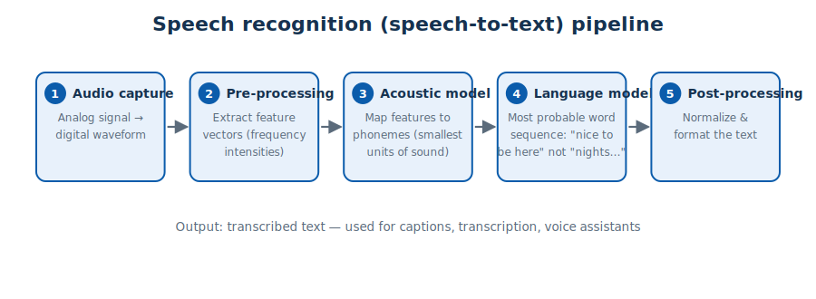
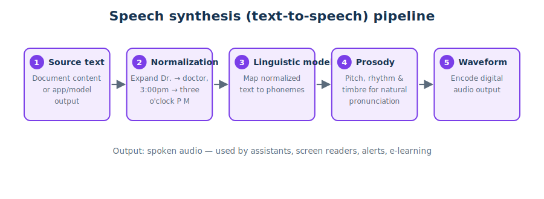

# Module 4 — AI Speech

> **Public references:** <https://aka.ms/mslearn-ai-speech-concepts> · <https://aka.ms/mslearn-get-started-ai-speech>

---

## 4.1 Speech-enabled solutions

| | **Speech recognition** | **Speech synthesis** |
|---|---|---|
| Also called | **Speech-to-text (STT)** | **Text-to-speech (TTS)** |
| Input | Audio file, stream, or microphone | Text (file or user/app input) |
| Output | Text transcription | Audio waveform of spoken speech |
| Use cases | Customer support, voice assistants, **automatic subtitles** (accessibility), meeting transcription, clinical note-taking | Chatbots/conversational AI, **screen readers** (accessibility), notifications & alerts, e-learning, game character voices |

> Both directions appear in accessibility questions — captions = STT, screen reader = TTS.

## 4.2 How speech recognition works



1. **Audio capture** — analog sound becomes a digital waveform.
2. **Pre-processing** — **feature vectors** are extracted from the waveform (signal intensity at
   specific frequencies). *Noise is removed, never added.*
3. **Acoustic modeling** — features are mapped to **phonemes**, the **smallest units of sound**
   in speech.
4. **Language modeling** — predicts the most probable **word sequence** from the phonemes
   (choosing *"nice to be here"* over *"nights two bee hear"*).
5. **Post-processing** — normalize and format the final text.

## 4.3 How speech synthesis works



1. **Source text** — document content or generated app/model output.
2. **Normalization** — expand abbreviations and numbers (*Dr. → doctor*, *3:00pm → three o'clock P M*).
3. **Linguistic modeling** — map normalized text to phonemes.
4. **Prosody generation** — adjust pitch, rhythm and timbre so pronunciation and cadence sound
   **natural** (prosody is not about volume or translation).
5. **Waveform encoding** — produce the digital audio output.

## 4.4 Speech in Microsoft Foundry

**Azure Speech in Foundry Tools** provides STT and TTS. Three ways to use it:

1. **Foundry portal playground** — experiment with real-time transcription (language
   identification, speaker diarization, output formats) and voice selection/tuning.
2. **Azure Speech SDK** — add speech directly to application code.
3. **MCP server** — expose speech capabilities to **agents** as tools.

**Speech-to-text (Python SDK) — the pattern:**

```python
import azure.cognitiveservices.speech as speechsdk

speech_config = speechsdk.SpeechConfig(subscription="<key>", endpoint="<foundry-endpoint>")
audio_config  = speechsdk.audio.AudioConfig(filename="voice-message.wav")

recognizer = speechsdk.SpeechRecognizer(speech_config=speech_config,
                                        audio_config=audio_config)
result = recognizer.recognize_once_async().get()
print(result.text)
```

**Text-to-speech — the pattern:** configure `SpeechConfig` the same way, set
`speech_synthesis_voice_name`, create a `SpeechSynthesizer`, call
`speak_text_async("...").get()`. **No `AudioConfig` is needed for default speaker output** (use
one to write to a file instead). The SDK handles **authentication, network communication and
audio generation** for you.

## 4.5 Voice Live — speech-capable agents

**Azure Speech in Foundry Tools: Voice Live** enables **real-time spoken conversation** with a
generative AI model that has instructions and tools:

- continuous conversation flow with **interruption handling** and **background-noise reduction**;
- experiment in the Foundry portal playground;
- build client apps with the **Voice Live SDK (`azure-ai-voicelive`)** — it opens a real-time
  connection, streams audio, and handles spoken responses and interruptions.

## 4.6 Quick self-check

1. Phonemes are mapped by which model — acoustic or language? *(acoustic)*
2. What does prosody control? *(natural pronunciation & cadence — pitch, rhythm, timbre)*
3. In TTS code, when can you omit `AudioConfig`? *(default speaker output)*
4. Which service powers real-time voice agents? *(Voice Live)*

**Next:** [Module 5 — Computer vision](05-computer-vision.md)
