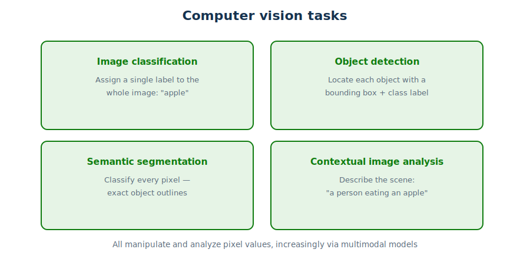
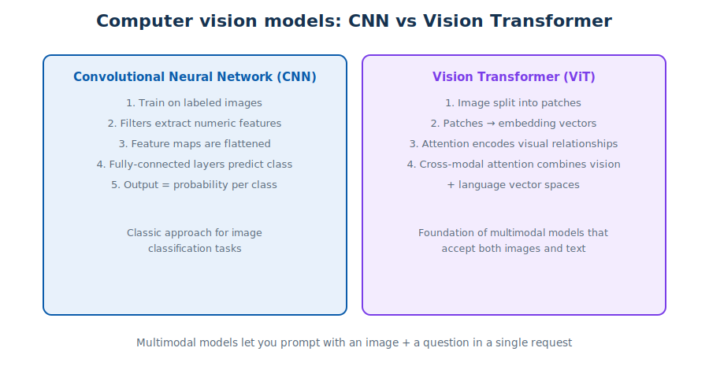
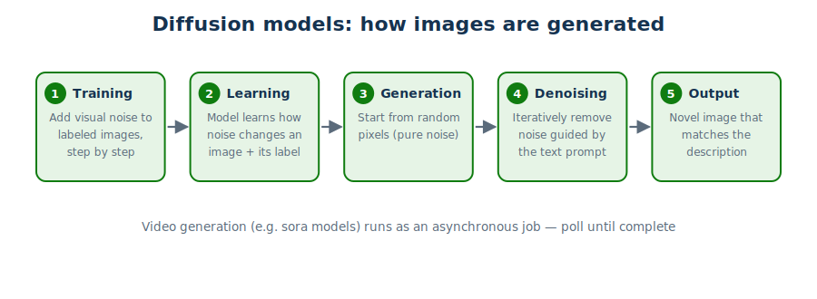

# Module 5 — Computer Vision

> **Public references:** <https://aka.ms/mslearn-ai-vision-concepts> · <https://aka.ms/mslearn-get-started-ai-vision>

---

## 5.1 Vision tasks and techniques



Computer vision is based on **manipulating and analyzing pixel values** (not file names or
metadata). The core tasks, in increasing granularity:

| Task | Output |
|---|---|
| **Image classification** | One label for the whole image (*"apple"*) |
| **Object detection** | A **bounding box + class label** for *each* object |
| **Semantic segmentation** | A class for **every pixel** — exact object outlines |
| **Contextual image analysis** | A natural-language description of the scene (*"a person eating an apple"*) |

> Quick discriminator: *"locate each object"* → detection; *"pixel-level mask"* → segmentation;
> *"describe/caption the image"* → contextual analysis.

## 5.2 Vision models: CNN and ViT



**Convolutional neural network (CNN)** — the classic classifier:
1. train on images with known labels;
2. **filters extract numeric features** from the pixels (they are *not* cosmetic effects);
3. feature maps are flattened;
4. a fully connected network predicts the class;
5. output includes a **probability per class**.

**Vision transformer (ViT)** — the modern, transformer-based approach:
1. the image is split into **patches**, each turned into an embedding vector from pixel values;
2. **attention** encodes relationships between visual features in vector space;
3. **cross-modal attention** combines the visual vector space with language vectors — producing
   a **multimodal model** that understands images *and* text together.

A **multimodal model** can understand and work with **more than one type of data** (e.g. accept
an image plus a text question in the same prompt).

## 5.3 Image analysis with multimodal models

Use the OpenAI API's **multi-part content** structure — one message containing an
`input_text` part and an `input_image` part. Images can be **URLs or base64-encoded data**:

```python
import base64
from openai import OpenAI

client = OpenAI(base_url="<foundry-endpoint>", api_key="<api-key>")

with open("banana.png", "rb") as f:
    image = base64.b64encode(f.read()).decode("utf-8")

response = client.responses.create(
    model="<model-deployment-name>",
    input=[{"role": "user", "content": [
        {"type": "input_text",  "text": "What desserts can I make with this?"},
        {"type": "input_image", "image_url": f"data:image/png;base64,{image}"}]}])
print(response.output[0].content[0].text)
```

## 5.4 Generating images and video



**Diffusion models** power image generation:
- **Training:** visual "noise" is added to labeled images step by step; the model learns how
  noise changes an image with a given description.
- **Generation:** the process is reversed — start from **random pixels** and iteratively remove
  the learned noise guided by the text prompt, revealing a novel image.

In Foundry:
- **Image generation** — search the catalog for **"text to image"** inference-task models
  (e.g. OpenAI **gpt-image** family); generate programmatically by sending text prompts through
  the **OpenAI Responses API** against your deployed image model.
- **Video generation** — search for **"video generation"** models (e.g. OpenAI **sora**).
  Video jobs run **asynchronously** because generation is **resource-intensive and takes time**:
  you submit the job, then poll for completion.

## 5.5 Quick self-check

1. Which task labels every pixel? *(semantic segmentation)*
2. What do CNN filters do? *(extract numeric features from images)*
3. Two accepted image formats in a multimodal prompt? *(URL or base64 data)*
4. Why is sora video generation asynchronous? *(resource-intensive, takes time)*

**Next:** [Module 6 — Information extraction](06-information-extraction.md)
