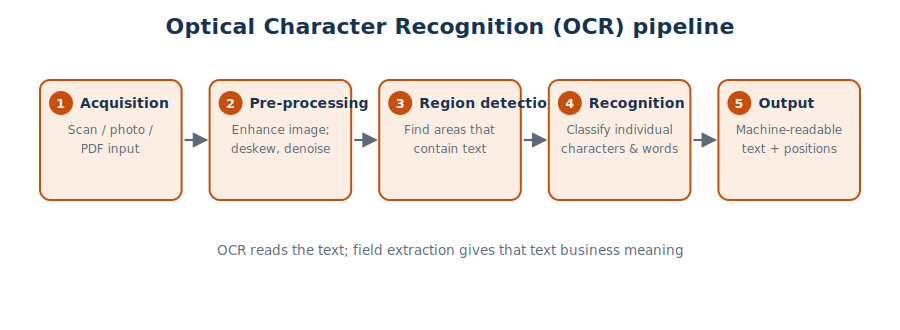
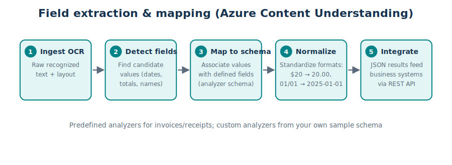

# Module 6 — Information Extraction

> **Public references:** <https://aka.ms/mslearn-ai-info-concepts> · <https://aka.ms/mslearn-get-started-information-extraction>

---

## 6.1 What is information extraction?

Information extraction means **analyzing unstructured content to identify and extract relevant
fields and values** — converting digital content into useful, structured data. Sources include:

- documents and emails,
- business cards and receipts,
- invoices, contracts and other forms,
- images,
- audio recordings and video.

Classic scenario: a photographed receipt becomes a pre-filled expense claim (vendor, date,
amount) with no manual typing.

## 6.2 Optical Character Recognition (OCR)

**OCR converts images of text into machine-readable text data.** The pipeline:

1. **Image acquisition & input** — scan, photo or PDF.
2. **Pre-processing & enhancement** — deskew, denoise, sharpen.
3. **Text region detection** — find the areas that contain text.
4. **Character recognition & classification** — identify the characters and words.
5. **Output generation & post-processing** — machine-readable text with positions.

OCR *reads* the text — it doesn't know what the text *means*.

## 6.3 Field extraction and mapping

Turning OCR output into business data:

1. **OCR output ingestion** — raw recognized text + layout.
2. **Field detection & candidate identification** — spot values that look like dates, totals,
   names.
3. **Field mapping & association** — attach each value to the right schema field. Generative AI
   improves this step by **using semantic language models to match extracted values to data
   fields accurately** (no hand-coded rules per document type).
4. **Data normalization & standardization** — `$20` → `20.00`, `01/01/2025` → `2025-01-01`.
5. **Integration** — structured results flow into business processes and systems.

## 6.4 Azure Content Understanding in Foundry Tools

**Azure Content Understanding** is Foundry's information-extraction service. Its key advantage
over plain OCR: it **understands document structure and maps extracted data to a defined
schema** (with confidence scores per field).

- **Analyzers** define **how content is processed and what structured data is returned**:
  - **predefined analyzers** for common documents — invoices, receipts, contracts, call
    recordings;
  - **custom analyzers** — define your own schema from **sample documents**.
- Results are retrieved as **JSON via the REST API**.
- With the Python SDK, analysis is **asynchronous**: you submit content, then **poll a URL until
  the analysis job completes** (results are not returned in the same request).

## 6.5 Audio and video extraction

The same analyzer concept applies to media:

- **post-call analysis** (contact centers — sentiment, topics, speakers),
- **voice-message automation**,
- **video call transcription and summary**,
- **video recording analysis**.

## 6.6 Quick self-check

1. What does OCR stand for and do? *(optical character recognition — images of text → machine-readable text)*
2. What defines the schema and processing behavior in Content Understanding? *(an analyzer)*
3. After submitting content via the SDK, how do you get results? *(poll until the job completes)*
4. Content Understanding vs OCR in one line? *(CU adds structure + schema mapping on top of reading text)*

**Back to the [course index](../README.md).**
